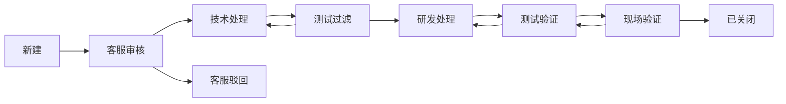
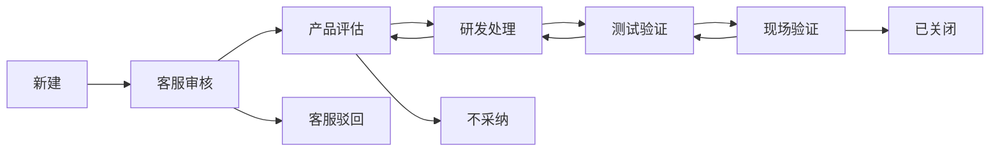
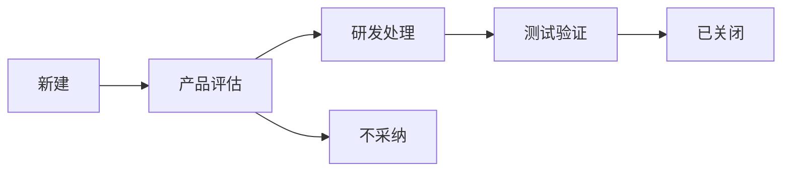

# Redmine-like Issue 全量重构设计

## 目标

当前工单系统不再按 `Ticket + RdTask` 两层闭环继续演进，改为按 Redmine 的 Issue Tracking 思路重构：一个 Issue 承载项目、跟踪、状态、优先级、指派、版本、分类、父子任务、关联关系、关注人、自定义字段、附件、工时和完整更新历史。

Redmine 是参照模型，不恢复 Redmine 同步，也不复制 Redmine/Rails 源码。实现仍保持当前 FastAPI + Tortoise + Vue 技术栈。

参考边界：

- Redmine 官方 Issue Tracking 设置：https://www.redmine.org/projects/redmine/wiki/RedmineIssueTrackingSetup
- Redmine Issues API：https://www.redmine.org/projects/redmine/wiki/Rest_Issues
- Redmine 项目设置：https://www.redmine.org/projects/redmine/wiki/RedmineProjectSettings
- Redmine 角色权限：https://www.redmine.org/projects/redmine/wiki/RedmineRoles

## 非目标

- 不实现 Redmine 插件体系。
- 不实现 Wiki、论坛、代码仓库、News 等非 Issue Tracking 模块。
- 不导入 GPL 源码。
- 不保留 `RdTask` 作为主流程模型。
- 不再新增客服页、技术页、产研任务页这种角色专属流程页作为主体验；角色差异走权限和工作流。

## 总体架构

重构后的核心是：

```text
Project
  -> Issue
      -> Journal / JournalDetail
      -> Attachment
      -> CustomValue
      -> Watcher
      -> IssueRelation
      -> TimeEntry
```

`Issue` 是唯一主流程对象。用户、渠道商、技术、客服、产品、研发、测试、管理员看到的是同一个 Issue，只是可选动作、可编辑字段和可见范围不同。

## 术语映射

| 当前系统 | Redmine-like 目标 |
| --- | --- |
| 工单 / Ticket | Issue |
| 现网问题 / 现网需求 / 产品建议 | Tracker |
| 工单状态枚举 | IssueStatus 配置表 |
| 客服审核 / 技术处理 / 产研任务 | WorkflowTransition |
| RdTask | 删除，历史迁移到 Journal 展示 |
| TicketActionLog | Journal + JournalDetail |
| 问题分类 | IssueCategory |
| 项目阶段 | CustomField 或 IssueCategory，按配置决定 |
| 服务器版本 / 客户端版本 | Version 或 CustomField，按 tracker 配置必填 |
| 技术处理人 | assigned_to_id |
| 提交人 | author_id |

## 数据模型

### Project

沿用现有 `Project`，补齐 Redmine 项目字段：

- `id`
- `name`
- `identifier`
- `description`
- `homepage`
- `parent_id`
- `status`
- `is_public`
- `default_version_id`
- `default_assignee_id`
- `created_at`
- `updated_at`

现有客户项目字段保留为业务扩展字段，不阻塞 Issue 模型。

### ProjectMember

项目成员关系：

- `project_id`
- `user_id`
- `role_id`

权限判断优先走项目成员角色；管理员全局绕过。

### Tracker

问题类型配置：

- `name`
- `description`
- `position`
- `default_status_id`
- `is_in_roadmap`
- `copy_workflow_from_id`

初始 tracker：

- 现网问题
- 现网需求
- 产品建议

### IssueStatus

状态配置：

- `name`
- `position`
- `is_closed`
- `is_default`

初始状态：

- 新建
- 客服审核
- 客服驳回
- 技术处理
- 测试过滤
- 产品评估
- 研发处理
- 测试验证
- 现场验证
- 已解决
- 已关闭
- 不采纳

关闭态：`已关闭`、`不采纳`。

### IssuePriority

优先级配置：

- 低
- 普通
- 高
- 紧急
- 立刻

### IssueCategory

项目内分类：

- `project_id`
- `name`
- `assigned_to_id`

可用于模块、产品线、问题分类。分类有默认负责人时，创建或更新 Issue 可自动指派。

### Version

版本/目标版本：

- `project_id`
- `name`
- `description`
- `status`: open / locked / closed
- `sharing`: none / descendants / hierarchy / tree / system
- `effective_date`

用于 Redmine 的 `fixed_version` 语义。服务器版本、客户端版本如果需要多值，可先作为自定义字段保留。

### Issue

主表。可以用新 `issue` 表，也可以保留 `ticket` 表名并扩展字段；推荐第一阶段保留 `ticket` 表名，降低迁移风险。

核心字段：

- `project_id`
- `tracker_id`
- `status_id`
- `priority_id`
- `category_id`
- `fixed_version_id`
- `parent_id`
- `root_id`
- `lft`
- `rgt`
- `subject`
- `description`
- `author_id`
- `assigned_to_id`
- `start_date`
- `due_date`
- `done_ratio`
- `estimated_hours`
- `closed_at`
- `is_private`
- `lock_version`
- `created_at`
- `updated_at`

当前 `company_name`、`contact_name`、`phone` 等提交字段作为业务字段保留，后续可转为自定义字段。

### Journal

一次更新记录：

- `journalized_type`: Issue
- `journalized_id`
- `user_id`
- `notes`
- `private_notes`
- `created_at`

### JournalDetail

字段级变更：

- `journal_id`
- `property`: attr / cf / relation
- `prop_key`
- `old_value`
- `value`

所有状态变更、指派变更、优先级变更、字段变更都写 JournalDetail。详情页历史记录以 Journal 为主，不再以动作枚举为主。

### CustomField

自定义字段定义：

- `type`: issue / project / user / time_entry
- `name`
- `field_format`: string / text / int / float / bool / date / list / user / version
- `possible_values`
- `default_value`
- `is_required`
- `is_filter`
- `searchable`
- `multiple`
- `visible`

### CustomFieldBinding

控制字段绑定范围：

- `custom_field_id`
- `tracker_id`
- `project_id`

不需要绑定时为空，表示全局可用。

### CustomValue

自定义字段值：

- `customized_type`: Issue / Project / User / TimeEntry
- `customized_id`
- `custom_field_id`
- `value`

### WorkflowTransition

状态流转规则：

- `role_id`
- `tracker_id`
- `old_status_id`
- `new_status_id`
- `assignee_required`
- `author_allowed`
- `assignee_allowed`

语义：某角色在某 tracker 下，当前状态可变更到哪些状态。

### WorkflowPermission

字段权限：

- `role_id`
- `tracker_id`
- `old_status_id`
- `field_name`
- `rule`: readonly / required

适用于标准字段和自定义字段。比如现网问题在提交时要求服务器版本、客户端版本。

### Watcher

关注人：

- `watchable_type`: Issue
- `watchable_id`
- `user_id`

### IssueRelation

Issue 关系：

- `issue_from_id`
- `issue_to_id`
- `relation_type`: relates / duplicates / duplicated / blocks / blocked / precedes / follows / copied_to / copied_from
- `delay`

### TimeEntry

工时：

- `project_id`
- `issue_id`
- `user_id`
- `activity_id`
- `hours`
- `comments`
- `spent_on`

### Query

保存的过滤器：

- `name`
- `user_id`
- `project_id`
- `visibility`
- `filters`
- `columns`
- `sort_criteria`

## 初始工作流

### 现网问题



### 现网需求



### 产品建议



## 角色权限

权限不写死在状态机里，落到角色权限和项目成员。

初始角色：

- 管理员
- 客服
- 技术
- 产品
- 研发
- 测试
- 用户
- 渠道商

关键权限：

- `view_issues`
- `add_issues`
- `edit_issues`
- `edit_own_issues`
- `manage_issue_relations`
- `add_issue_notes`
- `edit_issue_notes`
- `view_private_notes`
- `set_issues_private`
- `manage_watchers`
- `log_time`
- `view_time_entries`
- `manage_versions`
- `manage_categories`
- `save_queries`
- `manage_public_queries`

提交人和关注人可以查看 Issue；是否允许编辑由权限和 workflow permission 决定。

## 页面重构

### 项目页面

- 项目概览
- 问题
- 版本
- 日历
- 甘特图
- 成员
- 设置

第一阶段可以只实现“问题、版本、成员、设置”。

### 问题列表

Redmine-like 列表能力：

- 项目筛选
- tracker 筛选
- status 筛选
- priority 筛选
- assigned_to 筛选
- author 筛选
- category 筛选
- fixed_version 筛选
- 自定义字段筛选
- 保存查询
- 批量更新
- 导出

旧页面映射：

- 我的工单 -> 保存查询：我提交的 / 指派给我的 / 我关注的
- 客服审核 -> 保存查询：待客服审核
- 技术处理 -> 保存查询：指派给我的技术处理
- 产研任务 -> 保存查询：按角色可处理的 Issue

### 问题详情

布局：

- 标题、编号、状态、优先级
- 属性区：项目、tracker、状态、优先级、指派给、作者、分类、版本、父任务、开始/截止、完成率、预估工时
- 描述
- 附件
- 子任务
- 关联问题
- 关注人
- 工时
- 历史记录
- 更新按钮

### 更新问题

统一更新弹窗/页面：

- 状态
- 指派给
- 优先级
- 分类
- 目标版本
- 父任务
- 开始/截止日期
- 完成率
- 自定义字段
- 备注
- 私有备注
- 附件
- 工时

可选状态来自 `WorkflowTransition`；可编辑字段来自 `WorkflowPermission`。

### 管理后台

- Trackers
- Issue statuses
- Workflows: transitions
- Workflows: field permissions
- Priorities
- Custom fields
- Roles and permissions
- Enumerations / activities

## API 设计

### Issue

- `GET /api/v1/issues`
- `POST /api/v1/issues`
- `GET /api/v1/issues/{id}`
- `PUT /api/v1/issues/{id}`
- `DELETE /api/v1/issues/{id}`
- `POST /api/v1/issues/{id}/watchers`
- `DELETE /api/v1/issues/{id}/watchers/{user_id}`
- `POST /api/v1/issues/{id}/relations`
- `DELETE /api/v1/issues/{id}/relations/{relation_id}`
- `POST /api/v1/issues/{id}/time_entries`

### Config

- `GET /api/v1/issue_trackers`
- `GET /api/v1/issue_statuses`
- `GET /api/v1/issue_priorities`
- `GET /api/v1/issue_categories`
- `GET /api/v1/versions`
- `GET /api/v1/custom_fields`
- `GET /api/v1/workflows/transitions`
- `GET /api/v1/workflows/permissions`

管理接口同路径提供 POST/PUT/DELETE。

## 迁移策略

### 第一阶段：建 Redmine-like 内核

- 新增配置表和 Journal 表。
- 扩展 `ticket` 表为 Issue 字段。
- 保留旧 API 和旧页面，不影响现有提交入口。
- 初始化 tracker/status/priority/workflow/permissions。

### 第二阶段：统一更新动作

- 新增 issue controller/service。
- 所有状态变化通过一个 `update_issue` 入口。
- 每次更新写 `journal` 和 `journal_detail`。
- 旧 `TicketActionLog` 只读兼容，详情页优先读 Journal。

### 第三阶段：替换页面

- 新增 Redmine-like 问题列表和详情。
- 旧客服审核、技术处理、产研任务页改成保存查询入口，或直接移除菜单。
- 我的工单改为查询视图。

### 第四阶段：迁移历史

- `TicketActionLog` 转成 Journal。
- `RdTask` 转成 Journal 和 Issue 状态历史。
- 旧状态枚举映射到 IssueStatus。
- 旧根因、项目阶段、版本信息迁移到标准字段或 CustomValue。

### 第五阶段：清理旧模型

- 删除 `RdTask` 代码和菜单。
- 删除旧 role-specific API。
- 删除旧 `TicketStatus` / `TicketActionType` 对主流程的依赖。
- 保留兼容别名一段时间，避免前端缓存和外部调用立即失效。

## 旧状态映射

| 旧状态 | 新状态 |
| --- | --- |
| pending_review | 客服审核 |
| cs_rejected | 客服驳回 |
| tech_processing | 技术处理 |
| test_filtering | 测试过滤 |
| product_evaluation | 产品评估 |
| rd_processing | 研发处理 |
| test_verification | 测试验证 |
| field_verification | 现场验证 |
| pending_close | 已解决 |
| tech_rejected | 技术处理，带退回 Journal |
| done | 已关闭 |

## 验证标准

后端：

- `python -m compileall app`
- Issue 创建、更新、状态流转测试。
- workflow transition 测试：不同角色、tracker、状态的可选状态不同。
- workflow permission 测试：只读/必填字段生效。
- journal 测试：字段变化都能记录 old/new。
- watcher/relation/custom value/time entry 聚焦测试。
- 旧数据迁移测试。

前端：

- `cd web && pnpm.cmd run build`
- 问题列表筛选、保存查询、详情更新、历史记录展示手动验证。

## 风险和取舍

- 这是全量重构，不能用一次小补丁完成。最小可交付是“Redmine-like 内核 + 统一 Issue 更新 + Journal”。
- 自定义字段和 workflow permission 是复杂度最高的部分，但这是 Redmine-like 的核心，不能省。
- 第一阶段保留 `ticket` 表名是有意取舍：减少迁移爆炸，等新模型稳定后再决定是否改表名。
- 旧 `RdTask` 不再新增能力，只迁移和清理。

## 实施顺序

1. 数据模型和迁移。
2. 默认配置初始化。
3. Issue 更新服务和 Journal。
4. Workflow transition 和 field permission。
5. Redmine-like Issue API。
6. 前端问题列表和详情更新。
7. 保存查询。
8. Watcher、Relation、Version、Category、TimeEntry、CustomField。
9. 旧页面菜单降级为查询入口。
10. 历史数据迁移和 `RdTask` 清理。
