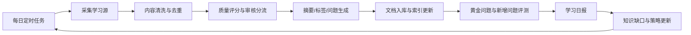

# Skill-Know 知识库 Agent 自进化方案

## 1. 目标

让 Skill-Know 知识库 Agent 每天自动完成“学习、整理、验证、反思、改进”的闭环，逐步提升知识覆盖率、检索命中率、回答准确率和来源可追溯性。

本方案只定义架构和落地路径，不包含编码实现。

## 2. 设计原则

- 不让 Agent 无限制学习外部内容，所有学习源必须可配置、可追溯、可关闭。
- 不直接覆盖旧知识，采用新增版本、标记过期、人工确认的方式降低污染风险。
- 不只做文档入库，还要做评测和反思；没有评测的“自学习”容易变成知识膨胀。
- 优先复用现有 Skill-Know 能力：文档管理、文档切分、索引、Reader Agent、黄金问题评测。
- 每次自动学习都生成报告，管理员可以看见新增内容、失败原因、质量变化和后续建议。

## 3. 总体闭环



## 4. 核心模块

### 4.1 学习源管理

用于配置 Agent 每天允许学习什么。

建议先支持以下来源：

- 已上传但未整理的 Skill-Know 文档。
- 指定目录或对象存储中的新文件。
- 内部工单、FAQ、实施记录、运维手册。
- 固定 URL、RSS 或可信网页。
- 历史对话中的低分问题和未命中问题。

每个学习源建议包含：

| 字段 | 说明 |
| --- | --- |
| 名称 | 学习源显示名 |
| 类型 | 文件、网页、接口、对话问题、工单等 |
| 地址 | 路径、URL 或接口配置 |
| 同步频率 | 每日、每周、手动 |
| 可信等级 | 高、中、低 |
| 是否自动入库 | 高可信可自动入库，低可信进入待审核 |
| 所属知识库/文件夹 | 对应 Skill-Know 文件夹 |
| 启用状态 | 支持随时暂停 |

### 4.2 内容采集

采集器只负责拿到原始内容和元数据，不做复杂决策。

输出统一结构：

| 字段 | 说明 |
| --- | --- |
| source_id | 学习源 ID |
| source_type | 来源类型 |
| source_uri | 原始来源地址 |
| title | 标题 |
| raw_content | 原始正文 |
| author | 作者或系统来源 |
| published_at | 原文发布时间 |
| fetched_at | 采集时间 |
| checksum | 内容哈希，用于去重 |

### 4.3 清洗、去重与质量评分

入库前先判断“该不该学”。

建议评分维度：

| 维度 | 说明 |
| --- | --- |
| 相关性 | 是否和当前业务、产品、配置、故障处理有关 |
| 新鲜度 | 是否比已有知识更新 |
| 完整性 | 是否有足够上下文，是否只是片段 |
| 可信度 | 是否来自官方、内部沉淀或人工确认来源 |
| 重复度 | 是否和已有文档高度重复 |
| 风险 | 是否包含账号、密码、密钥、客户隐私等敏感信息 |

处理结果分为四类：

- 自动入库：高相关、高可信、低风险。
- 待人工审核：有价值但可信度或风险不确定。
- 仅记录缺口：内容不足，但暴露了知识缺口。
- 丢弃：重复、低价值、明显无关或高风险。

### 4.4 知识整理

对通过筛选的内容生成结构化知识：

- 标题优化。
- 摘要。
- 关键词。
- 产品模块。
- 适用场景。
- 操作步骤。
- 常见问题。
- 可能的用户提问。
- 来源链接。
- 可信等级。
- 版本信息。

这一步可以调用大模型，但必须保留原文，不能只保存模型摘要。

### 4.5 文档入库与索引

建议复用现有文档链路：

- 文档元数据进入 `sk_document`。
- 切分结果进入 `sk_document_chunk`。
- 章节结构进入 `sk_document_section`。
- 行级文本进入 `sk_document_line`。
- 索引更新复用 `document_index_service` 和 Reader Agent 检索链路。

入库策略：

- 新内容创建新文档或新版本。
- 相同 `content_hash` 不重复入库。
- 与旧内容冲突时，旧内容标记为“可能过期”，进入人工确认。
- 自动学习生成的文档必须带上 `extra_metadata.auto_learned = true`、学习源、学习任务 ID 和质量评分。

### 4.6 评测与回归

现有项目已有 `eval_service`、`golden_case_service` 和 `/api/v1/skill-know/eval` 相关接口，可作为自进化评测基础。

每日评测建议分三组：

| 评测集 | 目的 |
| --- | --- |
| 黄金问题 | 核心业务问题不能退化 |
| 新增问题 | 验证今天学习的内容是否能被检索到 |
| 缺口问题 | 验证过去答不好的问题是否改善 |

指标建议：

- Top1 命中率。
- Top3 命中率。
- TopK 命中率。
- 平均检索耗时。
- 回答是否引用正确来源。
- 回答是否出现无来源断言。
- 与上一日相比是否退化。

重要注意：

当前默认黄金问题里存在疑似中文编码异常的内容，正式启用自进化前应先治理黄金问题数据。评测集本身不干净时，Agent 会围绕错误目标优化。

### 4.7 学习日报

每天生成一份报告，建议包含：

- 今日采集来源数量。
- 新增文档数量。
- 自动入库数量。
- 待审核数量。
- 丢弃数量和原因。
- 新增知识主题。
- 黄金问题命中率变化。
- 低分问题列表。
- 过期知识候选。
- 明日建议学习任务。

日报可以先存为 JSON 和 Markdown，后续再做后台页面。

### 4.8 知识缺口管理

Agent 每次回答失败、检索为空、用户追问纠错时，都应沉淀为知识缺口。

知识缺口字段建议：

| 字段 | 说明 |
| --- | --- |
| question | 用户问题 |
| failure_type | 无检索结果、检索错误、答案不完整、来源错误等 |
| expected_topic | 预估主题 |
| related_conversation_id | 来源会话 |
| status | 待学习、已学习、已忽略 |
| priority | 优先级 |
| resolved_by_document_id | 解决该缺口的文档 |

每日学习任务优先处理高频、高优先级缺口。

## 5. 建议数据对象

### 5.1 自学习任务

用于记录每日运行批次。

| 字段 | 说明 |
| --- | --- |
| id/uuid | 任务标识 |
| task_type | daily、manual、backfill |
| status | pending、running、success、partial_failed、failed |
| started_at/finished_at | 起止时间 |
| source_count | 学习源数量 |
| fetched_count | 采集数量 |
| indexed_count | 入库数量 |
| review_count | 待审核数量 |
| rejected_count | 丢弃数量 |
| metrics | 评测指标快照 |
| error_message | 错误信息 |

### 5.2 学习候选项

用于承接“采集到但还没入库”的内容。

| 字段 | 说明 |
| --- | --- |
| task_id | 所属任务 |
| source_uri | 原始来源 |
| title | 标题 |
| content_hash | 内容哈希 |
| quality_score | 质量评分 |
| decision | auto_index、review、gap_only、reject |
| reason | 决策原因 |
| normalized_payload | 清洗后的结构化内容 |

### 5.3 自学习报告

用于前端展示和历史追踪。

| 字段 | 说明 |
| --- | --- |
| task_id | 所属任务 |
| summary | 总结 |
| added_documents | 新增文档 |
| review_items | 待审核项 |
| rejected_items | 丢弃项 |
| eval_before | 学习前评测 |
| eval_after | 学习后评测 |
| regressions | 退化问题 |
| next_actions | 下一步建议 |

## 6. 后台页面建议

### 6.1 自学习总览

展示：

- 今日运行状态。
- 最近 7 天学习趋势。
- 新增文档数量。
- 待审核数量。
- 黄金问题命中率。
- 最近一次失败原因。

### 6.2 学习源配置

支持：

- 新增、编辑、停用学习源。
- 配置可信等级。
- 配置是否自动入库。
- 手动触发某个来源同步。

### 6.3 学习报告

支持：

- 查看每日学习报告。
- 查看新增文档。
- 查看评测变化。
- 查看低分问题。
- 一键将建议问题加入黄金问题。

### 6.4 待审核知识

支持：

- 预览原文和模型摘要。
- 查看质量评分原因。
- 批准入库。
- 驳回。
- 合并到已有文档。
- 标记旧文档过期。

### 6.5 知识缺口

支持：

- 查看未解决问题。
- 按频率和优先级排序。
- 绑定到已有文档。
- 触发定向学习。
- 转为黄金问题。

## 7. 定时策略

推荐每日凌晨执行一次：

```text
01:00 采集学习源
01:20 清洗、去重、评分
01:40 自动入库高可信内容
02:00 更新索引
02:10 运行黄金问题评测
02:30 生成学习日报
```

人工审核不需要阻塞每日任务。低可信内容进入待审核区，管理员白天处理即可。

## 8. 安全与风控

必须内置以下规则：

- 敏感信息检测：账号、密码、Token、密钥、手机号、客户隐私等不得自动入库。
- 来源白名单：默认只学习配置过的来源。
- 自动入库阈值：质量评分低于阈值进入待审核。
- 版本保留：旧知识不物理删除。
- 可回滚：每个学习任务能定位自己新增了哪些文档和索引。
- 可审计：每次采集、评分、入库、评测都有日志。
- 防提示注入：网页或外部文档中的“忽略系统指令”等内容只能作为文档正文，不能影响 Agent 系统行为。

## 9. 分阶段落地

### 第一阶段：每日评测和报告

目标：先知道知识库每天有没有变好。

范围：

- 治理黄金问题数据。
- 每天自动运行黄金问题检索评测。
- 生成学习日报雏形。
- 记录低分问题和知识缺口。

验收：

- 能看到每日 Top1、Top3、TopK 命中率。
- 能看到退化问题。
- 能把低分问题沉淀为缺口。

### 第二阶段：可信来源自动入库

目标：让高可信内部资料自动进入知识库。

范围：

- 学习源配置。
- 内容采集。
- 去重和质量评分。
- 高可信内容自动入库。
- 低可信内容进入待审核。

验收：

- 每天可自动新增文档。
- 重复内容不会反复入库。
- 每个自动入库文档都可追溯来源和任务。

### 第三阶段：自我反思与学习计划

目标：让 Agent 根据失败问题决定明天学什么。

范围：

- 知识缺口管理。
- 从历史对话提取失败问题。
- 自动生成学习建议。
- 将高价值缺口转为黄金问题。

验收：

- 高频失败问题会进入学习计划。
- 新学习内容能改善对应问题命中率。
- 报告能解释“为什么今天学习这些内容”。

### 第四阶段：策略优化

目标：让 Agent 优化检索和整理策略。

范围：

- 分析 chunk 大小、标题、标签对命中的影响。
- 对低命中文档建议重新切分或补充标题。
- 对过期知识提出合并或下线建议。

验收：

- 检索命中率持续可观测。
- 退化能被发现并回滚。
- 管理员能批准策略调整。

## 10. 与现有代码的衔接点

建议后续编码时优先从这些位置切入：

| 能力 | 现有位置 |
| --- | --- |
| 文档接口 | `app/api/v1/skill_know/documents.py` |
| 文档服务 | `app/services/skill_know/document_service.py` |
| 文档索引 | `app/services/skill_know/document_index_service.py` |
| 检索评测 | `app/services/skill_know/eval_service.py` |
| 黄金问题 | `app/services/skill_know/golden_case_service.py` |
| Reader Agent | `app/services/skill_know/reader_agent/` |
| 对话服务 | `app/services/skill_know/chat_service.py` |
| 文档页面 | `web/src/views/skill-know/documents/index.vue` |
| 对话页面 | `web/src/views/skill-know/chat/index.vue` |
| 设置页面 | `web/src/views/skill-know/llm-settings/index.vue` |

新增页面建议放在：

- `web/src/views/skill-know/evolution/index.vue`
- `web/src/views/skill-know/evolution-sources/index.vue`
- `web/src/views/skill-know/evolution-reports/index.vue`

新增后端接口建议挂在：

- `/api/v1/skill-know/evolution/tasks`
- `/api/v1/skill-know/evolution/sources`
- `/api/v1/skill-know/evolution/candidates`
- `/api/v1/skill-know/evolution/reports`
- `/api/v1/skill-know/evolution/gaps`

## 11. 关键 ADR

### ADR-001：自进化优先做闭环，不优先做全自动外部学习

决策：

第一阶段先做评测、报告、缺口沉淀，再做自动入库。

原因：

- 没有评测就无法证明知识库变好。
- 外部内容质量不可控，直接自动学习容易污染知识库。
- 当前项目已经有评测服务和黄金问题雏形，复用成本低。

代价：

- 前期看起来“自动学习”能力较弱。
- 需要先投入时间整理黄金问题。

### ADR-002：自动学习内容默认进入版本化文档，不覆盖旧文档

决策：

自动学习产生的新内容以新文档、新版本或待审核项方式保存，不直接覆盖旧知识。

原因：

- 方便审计和回滚。
- 避免错误内容覆盖历史正确答案。
- 适合知识库长期演进。

代价：

- 需要处理重复和过期标记。
- 管理端需要提供审核、合并、过期操作。

### ADR-003：评测集是自进化系统的核心资产

决策：

黄金问题、低分问题、新增问题共同构成每日评测基础。

原因：

- 自进化是否有效必须可量化。
- 黄金问题能防止核心能力退化。
- 低分问题能指导下一步学习。

代价：

- 需要维护评测集质量。
- 默认问题存在编码异常时必须先修复。

## 12. 最小启动清单

第一周建议只做这些事情：

- 梳理 30 个高价值黄金问题。
- 修复当前默认黄金问题的中文编码和期望命中条件。
- 设计每日学习报告 JSON 结构。
- 设计知识缺口字段。
- 明确第一批可信学习源。
- 约定自动入库阈值和人工审核规则。

完成这些后，再进入编码实现会更稳。
