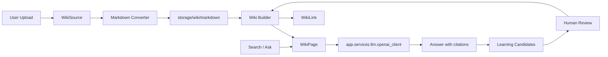

# Enterprise LLM Wiki Knowledge Base Design

## Goal

Build a shared enterprise knowledge base in the current FastAPI + Vue system using the `llm-wiki-agent` idea: import source documents, convert them to Markdown, and compile them into interlinked wiki pages that can be browsed, searched, and used as context for LLM answers.

This replaces the removed Skill-Know business surface. It does not restore the old Skill-Know module.

## External Project Fit

`SamurAIGPT/llm-wiki-agent` is best treated as a protocol and directory convention, not as a runtime dependency. Its useful idea is:

- `raw/`: original source material
- `wiki/`: generated Markdown wiki pages
- `graph/`: link/entity relationship outputs
- agent-driven maintenance of summaries, entities, concepts, and cross-links

The current project should implement this pattern natively so authentication, roles, uploads, audit logs, menus, and deployment stay inside the existing app.

## Scope

First release:

- Shared enterprise-wide knowledge base.
- Authenticated users can read/search/ask.
- Administrators, customer service, and technical roles can import documents and rebuild wiki pages.
- Supported imports: `.md`, `.txt`, `.pdf`, `.docx`, `.xlsx`, `.csv`, `.html`.
- LLM compiles imported Markdown into wiki-style pages.
- Incremental learning: new imports update existing wiki pages instead of rebuilding everything.
- Self-learning: low-confidence answers and repeated misses create reviewable learning candidates.
- Keyword search over source titles and wiki page content.
- Question answering uses top matching wiki pages as context.

Out of scope for first release:

- Vector database.
- RAG vector retrieval.
- Graph visualization.
- Multi-agent orchestration.
- Auto self-evolution/evaluation reports.
- Fine-grained per-user document visibility.
- Legacy Office formats: `.doc`, `.xls`, `.ppt`.

## Architecture



## Backend Modules

Add `app/api/v1/wiki/`:

- `sources.py`: upload, list source documents, retry failed imports.
- `pages.py`: list wiki pages, get page detail.
- `search.py`: keyword search and ask endpoint.

Add `app/services/wiki/`:

- `import_service.py`: validate upload, save source file, create import job.
- `markdown_converter.py`: convert supported document types to Markdown.
- `wiki_builder.py`: call the existing LLM client to generate wiki pages.
- `search_service.py`: retrieve relevant pages with simple database search.
- `learning_service.py`: record unanswered questions, repeated misses, and proposed page updates.

Reuse:

- `app/services/llm/openai_client.py` for OpenAI-compatible and Ollama chat.
- Existing auth, permission, upload-size, and audit-log patterns.
- Existing project import dependency `openpyxl` for `.xlsx`.

## Data Model

Add Tortoise models:

- `WikiSource`
  - `id`, `title`, `filename`, `file_path`, `file_type`, `file_size`
  - `content_hash`, `markdown_path`, `status`, `error_message`
  - `created_by`, timestamps

- `WikiPage`
  - `id`, `path`, `title`, `page_type`, `content`
  - `source_id`, `summary`, `content_hash`, timestamps
  - `path` is unique, examples: `sources/install-guide`, `concepts/license-renewal`

- `WikiLink`
  - `id`, `from_page_id`, `to_page_id`, `link_text`

- `WikiIngestJob`
  - `id`, `source_id`, `status`, `stage`, `error_message`, timestamps

- `WikiLearningCandidate`
  - `id`, `question`, `answer`, `evidence_page_ids`, `reason`
  - `proposed_page_path`, `proposed_content`, `status`, `reviewed_by`
  - `created_at`, `updated_at`

Keep this in MySQL. Do not add a vector database in the first release.

## File Layout

Use:

- `storage/wiki/raw/<yyyyMMdd>/<uuid>.<ext>`
- `storage/wiki/markdown/<source_uuid>.md`

Database remains the source of truth for UI queries. Files are retained for auditability and reprocessing.

## Import Flow

1. User uploads a file.
2. Backend validates extension and size.
3. Backend stores the raw file and records `WikiSource(status='pending')`.
4. Background task converts the file to Markdown.
5. LLM receives the Markdown and returns structured JSON:
   - source page title and summary
   - concepts
   - entities
   - wikilinks
6. Backend merges pages by stable `path` and `content_hash`.
   - New source pages are inserted.
   - Existing concept/entity pages are updated when the LLM returns a materially changed summary.
   - Existing links are replaced for pages affected by the current source only.
7. Source status becomes `completed` or `failed`.

Known simplification:

```python
# ponytail: database keyword search only; do not add a vector store unless explicitly requested.
```

## Incremental Learning

Each import is processed independently. The builder only updates wiki pages touched by the new source. It uses deterministic paths such as `sources/<slug>`, `concepts/<slug>`, and `entities/<slug>` so later imports can merge into existing pages.

Duplicate source files are detected by `content_hash`. Reimporting unchanged content is skipped. Reimporting changed content creates a new source version and refreshes only the derived pages for that source.

## Self-Learning

Question answering records learning candidates when:

- no relevant keyword match is found;
- the LLM says the wiki does not contain enough evidence;
- users mark an answer as unhelpful;
- the same or similar question appears repeatedly.

Self-learning is review-gated. The system may propose a new page or an update to an existing page, but it does not publish generated knowledge without a human approving it. This avoids poisoning the shared enterprise wiki with hallucinated content.

## Markdown Conversion

Use the smallest existing tooling:

- `.md`, `.txt`: read text.
- `.csv`: parse with Python stdlib `csv`, render Markdown table.
- `.html`: strip tags with stdlib `html.parser` or minimal existing utility.
- `.docx`: use `python-docx`, already present.
- `.xlsx`: use `openpyxl`, already present.
- `.pdf`: use existing `pdfminer-six`.

If a dependency is not currently installed, prefer adding only the one proven parser needed for that format. Do not add `markitdown[all]` in the first pass.

## LLM Prompt Contract

The builder asks for JSON, not free-form Markdown:

```json
{
  "source_page": {"title": "...", "summary": "...", "content": "..."},
  "concepts": [{"title": "...", "summary": "...", "content": "..."}],
  "entities": [{"title": "...", "summary": "...", "content": "..."}],
  "links": [{"from": "...", "to": "...", "text": "..."}]
}
```

Backend validates the response and falls back to a single source page if JSON parsing fails.

## Frontend

Add one top-level menu named `Wiki`.

Pages:

- `web/src/views/wiki/sources/index.vue`
  - upload document
  - show import status
  - retry failed import

- `web/src/views/wiki/pages/index.vue`
  - tree/list of pages by type
  - Markdown detail viewer

- `web/src/views/wiki/search/index.vue`
  - search box
  - ask question
  - answer with cited wiki pages

- `web/src/views/wiki/learning/index.vue`
  - list proposed learning candidates
  - approve, reject, or edit proposed wiki updates

Use the existing API wrapper style in `web/src/api/index.js`. Avoid a new frontend state library.

## Permissions

Enterprise shared knowledge base:

- All authenticated users: read pages, search, ask.
- Admin, customer service, technical roles: upload and rebuild.
- Superuser/admin: delete sources/pages.

Role backfill follows existing `init_roles()` style.

## Error Handling

- Unsupported extension: reject before saving.
- Conversion failure: mark source `failed`, keep raw file.
- LLM failure: mark job `failed`, allow retry.
- JSON parse failure: create a basic source page from Markdown and record a warning.
- Duplicate content hash: reuse existing completed source unless user explicitly reimports.
- Learning candidate approval failure: keep the candidate pending and show the validation error.

## Testing

Small checks only:

- Unit test Markdown conversion for `.txt`, `.csv`, and one fake `.xlsx`.
- Unit test LLM JSON normalization/fallback.
- Unit test incremental merge by stable wiki page path.
- Unit test learning candidate creation for no-match answers.
- Compile check: `python -m compileall app`.
- Frontend build: `cd web && pnpm.cmd run build`.

No browser automation for first release unless UI bugs appear.

## Rollout Plan

1. Add backend models, schemas, services, and routes.
2. Add menu and role permissions.
3. Add incremental merge and learning-candidate flow.
4. Add minimal frontend pages.
5. Add focused tests.
6. Verify compile and frontend build.

## Fixed Decisions

- PDF import uses the existing `pdfminer-six` dependency.
- Deletion policy: first release deletes DB rows and leaves raw files.
- Search ranking: first release uses simple keyword scoring, not embeddings.
- No vector database or vector RAG is used.
- Self-learning proposals require human approval before changing published wiki pages.
